# 2020_OO

## A班2020_OO_03 B班2020_OO_04

### 組別：第四組 組長：吳承翰 組員：廖敏任、歐健夫、黃識宇、王佳龍、許伯宇
### 題目：人臉辨識
### 專題內容：收集人像照片並訓練模型，產生模型後在行動裝置進行人臉辨識。
### 分工：廖敏任 吳承翰 (後端) 歐健夫 王佳龍 (前端) 黃識宇 許伯宇 (文書)
      

### 甘特圖
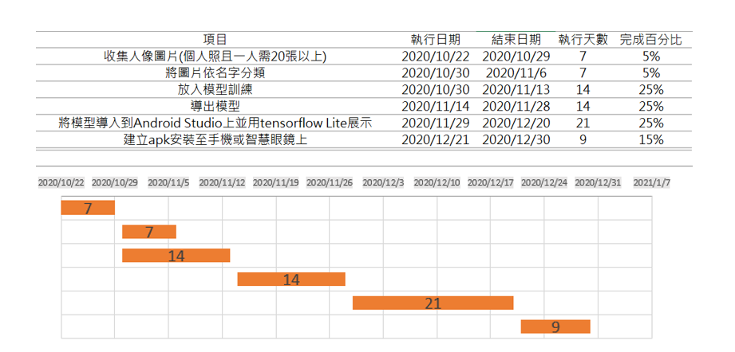

### CPM
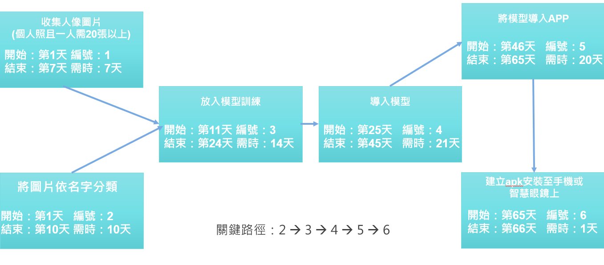

### 功能性需求跟非功能性需求
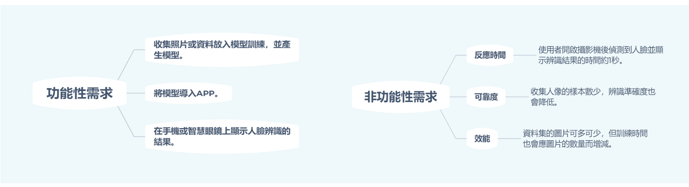

### 功能分解圖
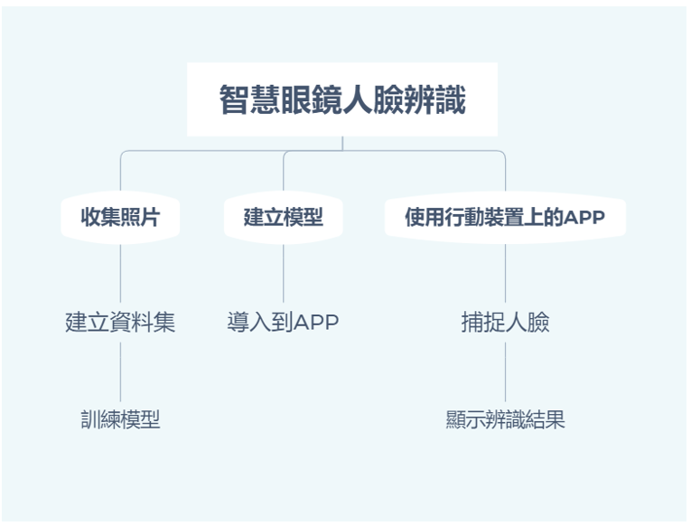

### 需求分析的文字描述

### 使用案例圖
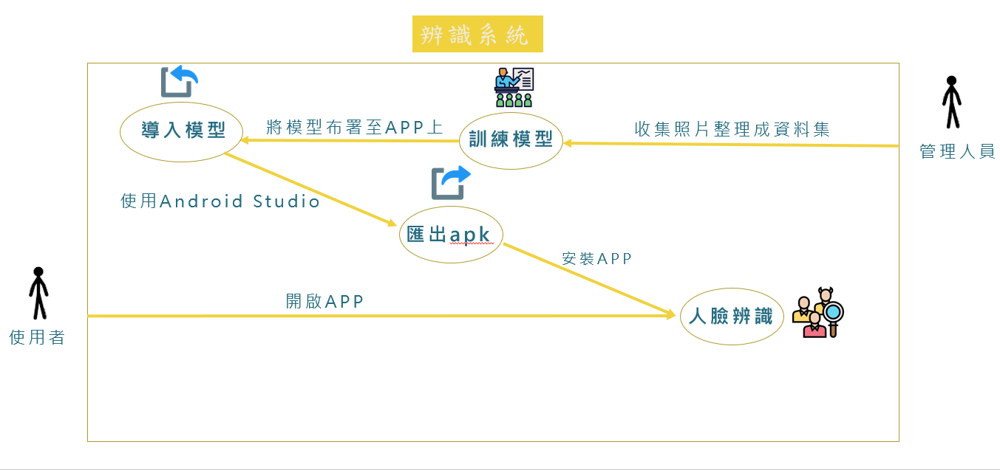

### 使用案例說明
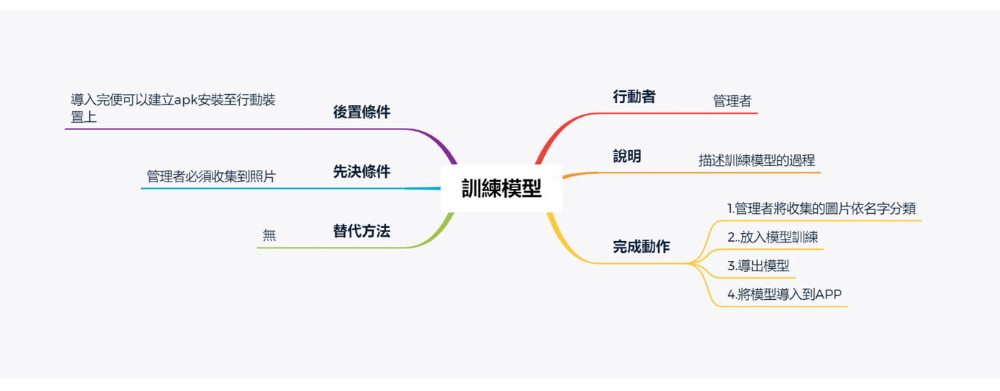
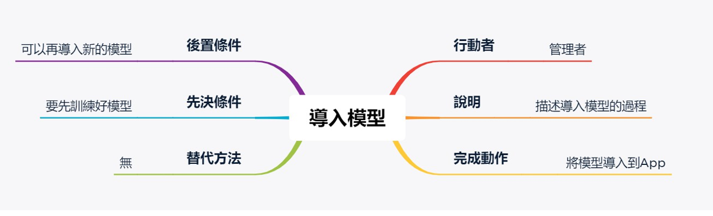
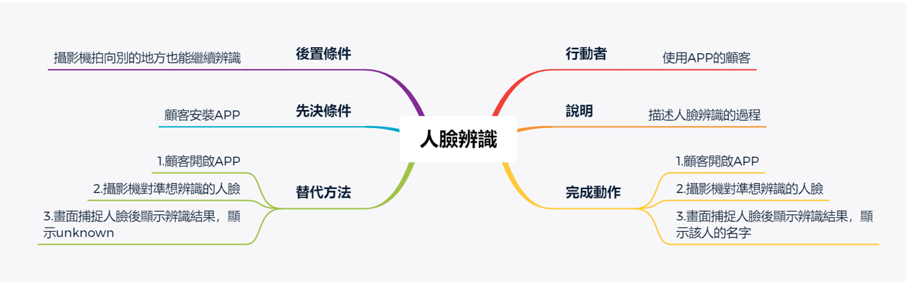

### 系統環境圖
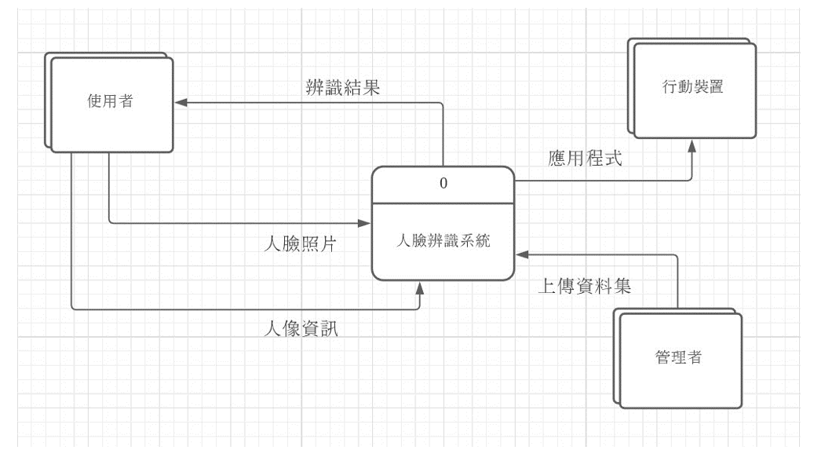

### 系統環境圖 圖0

### UML
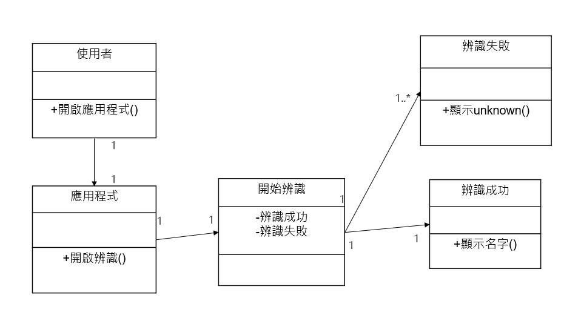

### 循序圖
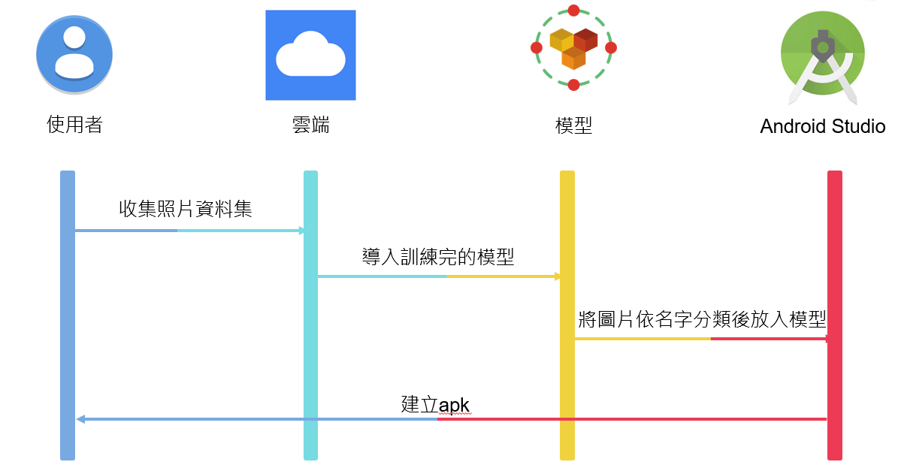
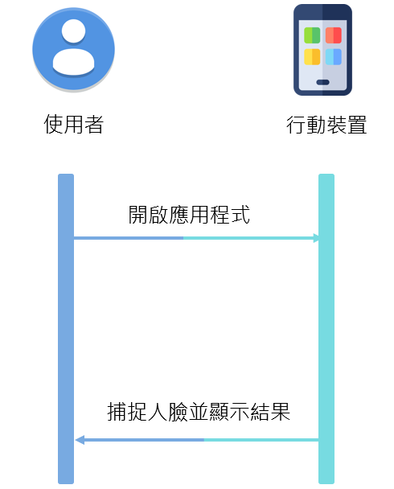
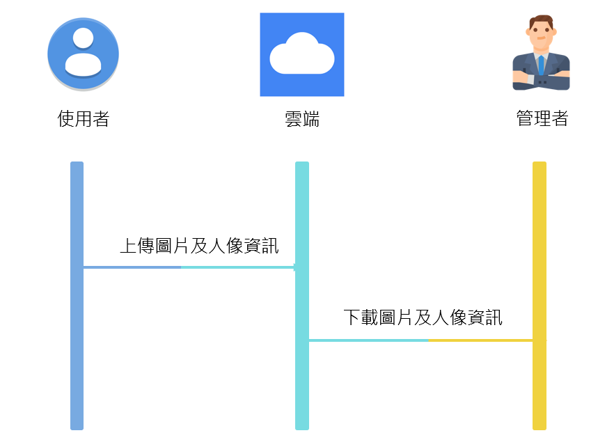

### 活動圖

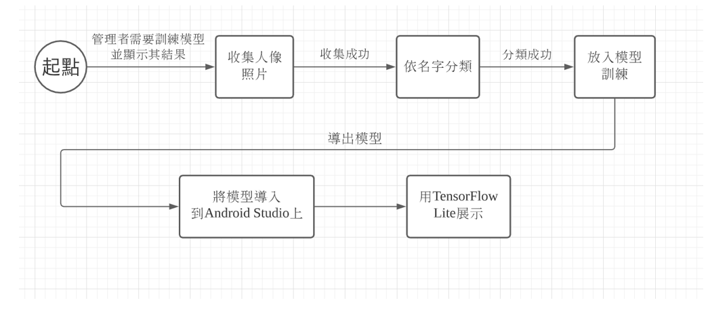
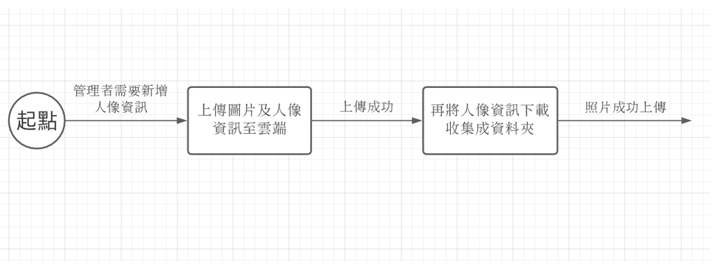

### 分鏡圖
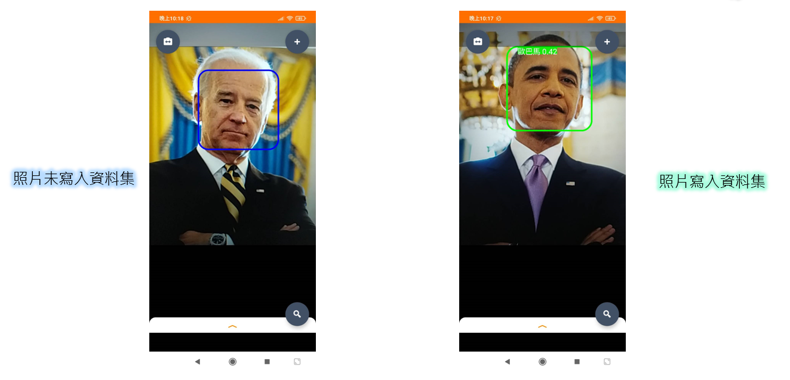

### 預計進度
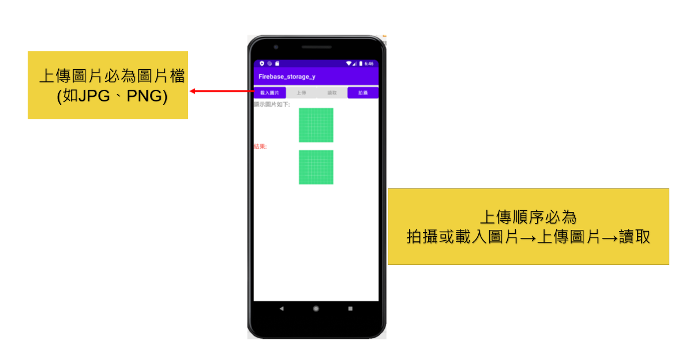
### 輸入欄位之資料型態與驗證規則
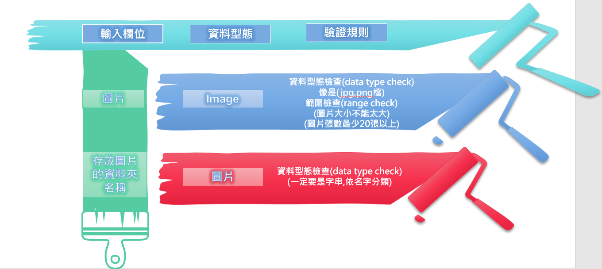

### 實體關係圖
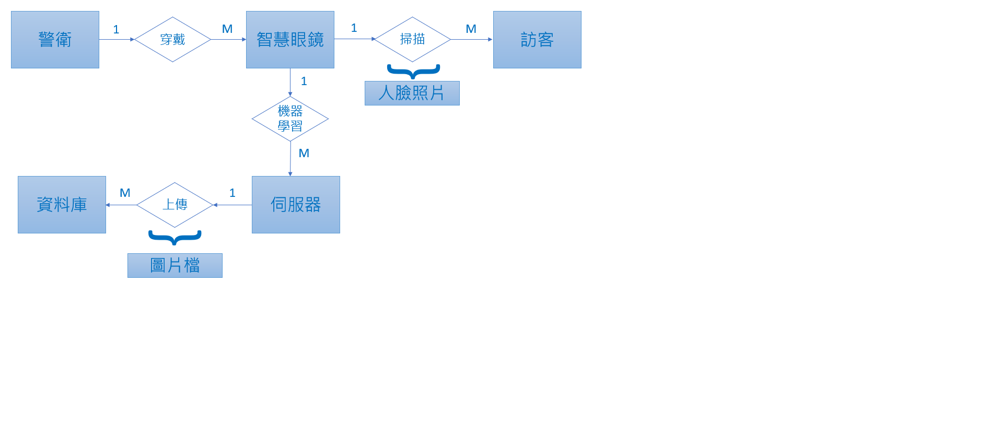

### 期末ppt

https://drive.google.com/file/d/1lhMtIiYKgWHKlA6-ba7ZwPFM0svChfI_/view?usp=sharing
