# 2020_OO

## A班2020_OO_03 B班2020_OO_04

### 組別：第四組 組長：吳承翰 組員：廖敏任、歐健夫、黃識宇、王佳龍、許伯宇
### 題目：人臉辨識
### 專題內容：收集人像照片並訓練模型，產生模型後在行動裝置進行人臉辨識。
### 分工：廖敏任 吳承翰 (後端) 歐健夫 王佳龍 (前端) 黃識宇 許伯宇 (文書)
      

#### 甘特圖

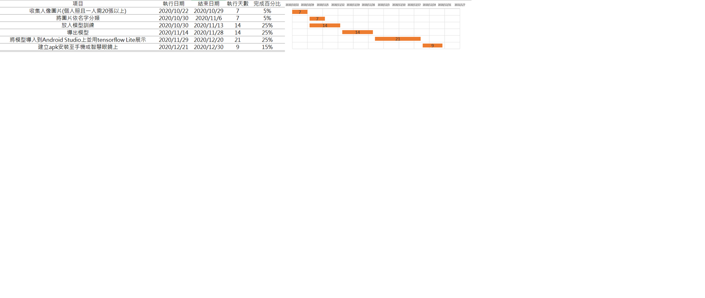

#### CPM
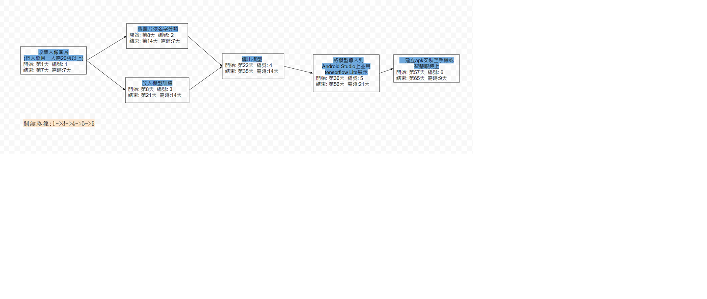

### 功能性需求 :
##### 收集照片成資料集放入模型訓練，並產生模型
##### 將模型導入到Android Studio上並用tensorflow Lite展示
##### 在手機或智慧眼鏡上顯示人臉辨識的結果

### 非功能性需求： 
##### 反應時間：使用者開啟攝影機後偵測到人臉並顯示辨識結果的時間約1秒。
##### 可靠度：收集人像的樣本數少，辨識準確度也會降低。
##### 效能：資料集的圖片可多可少，但訓練時間也會應圖片的數量而增減。
### 功能分解圖

### 需求分析的文字描述
##### 1.使用者藉由此軟體對目標的臉部進行辨識
##### 2.管理者可以後台載入以新增、變更、刪除人臉資
##### 3.管理者可藉由後台來管理使用者權限
##### 4.管理者可以透過後台來調整辨識精準度

### 使用案例圖
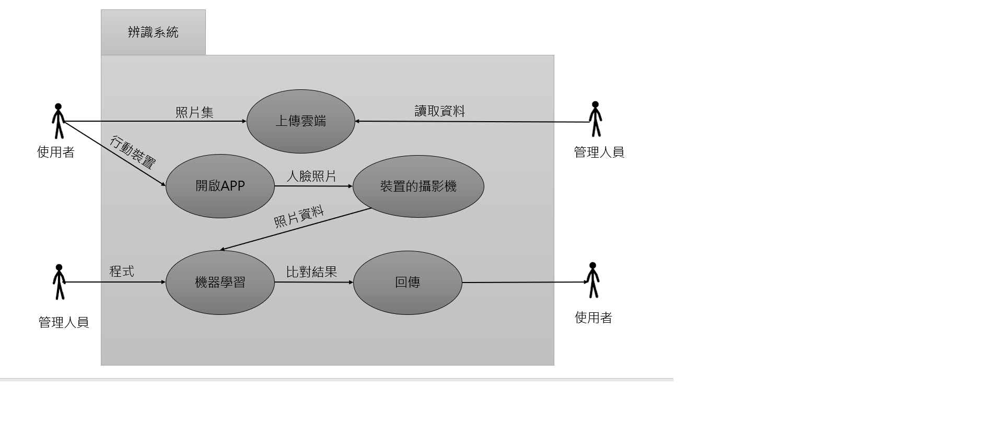

### 使用案例說明
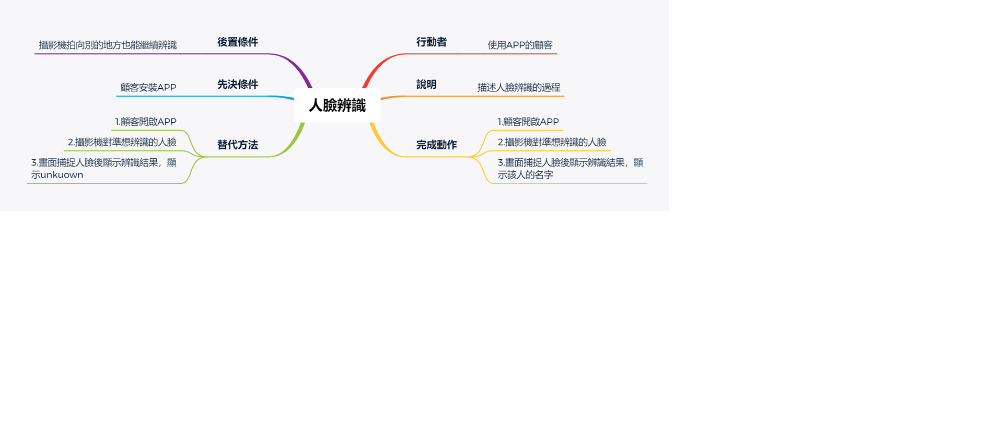
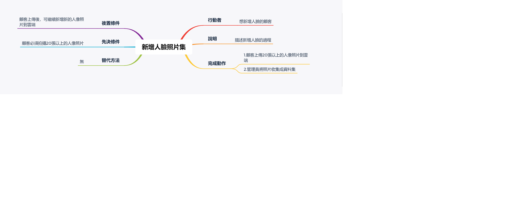

### 系統環境圖

### 系統環境圖 圖0
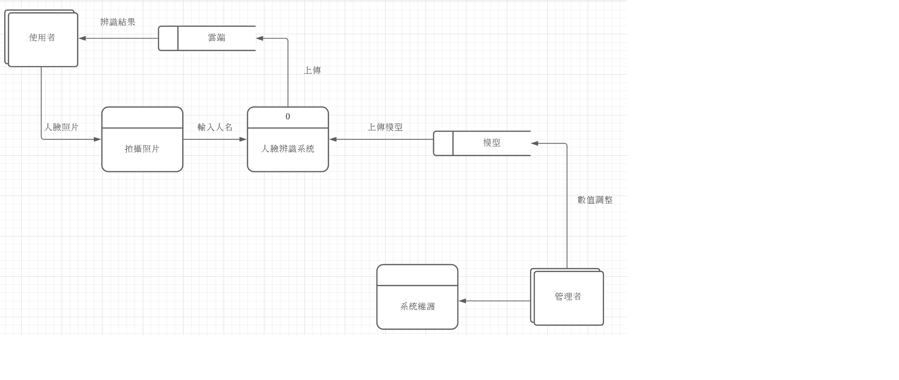

### UML
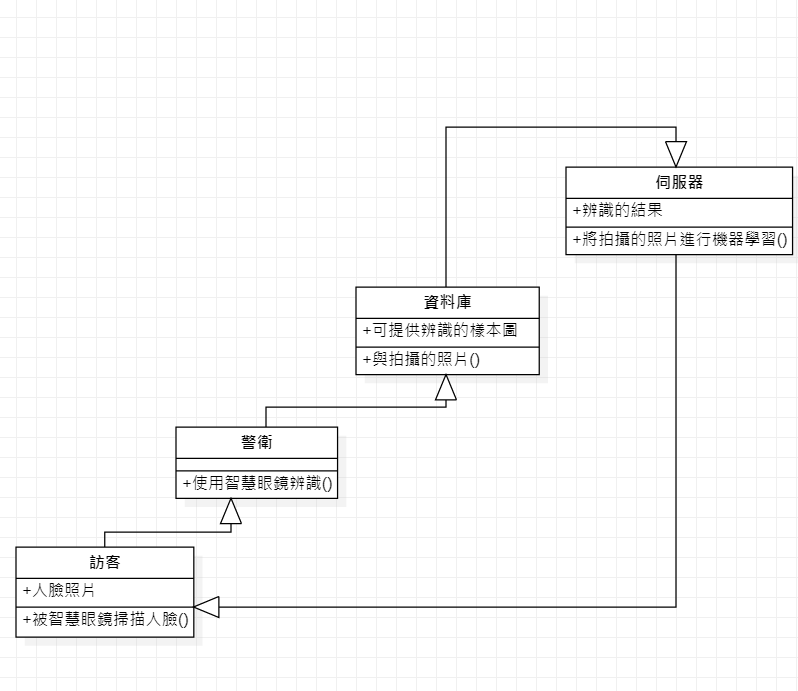

### 循序圖

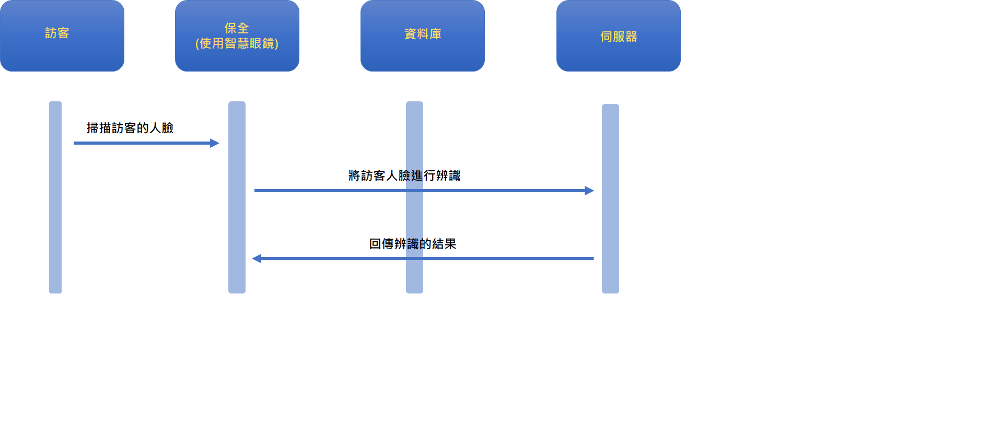

### 活動圖
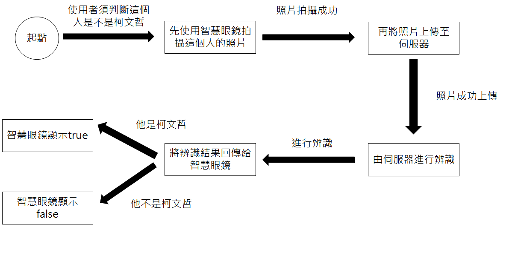
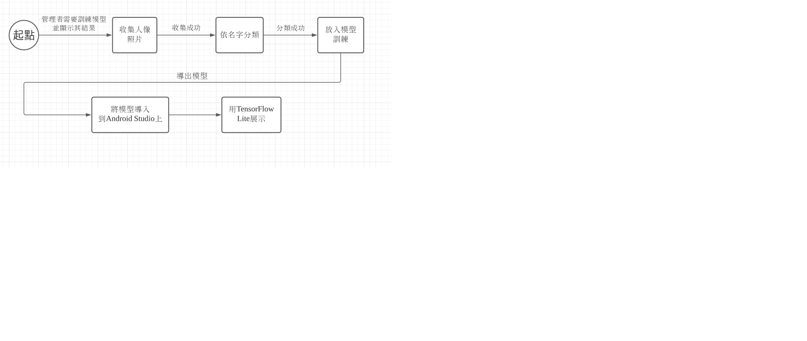
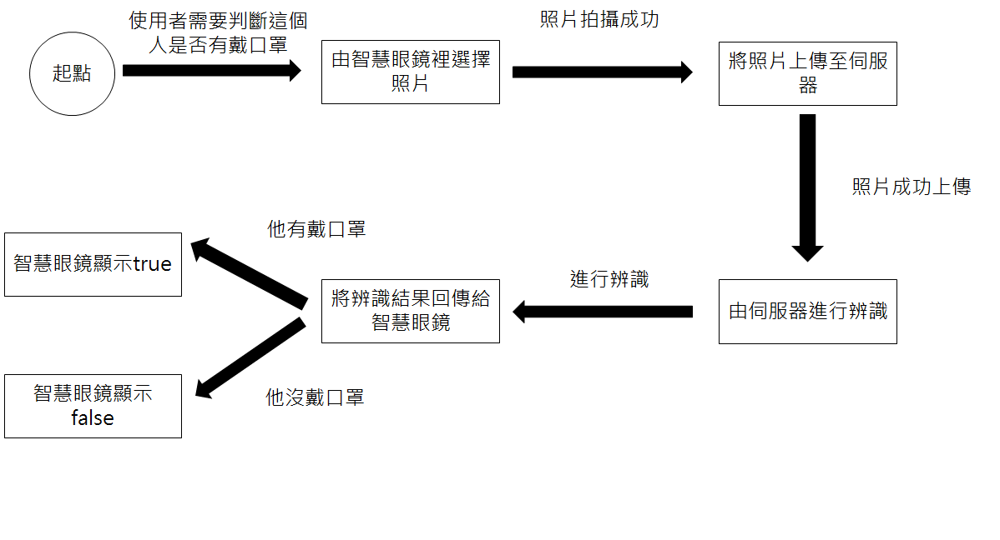

### 分鏡圖
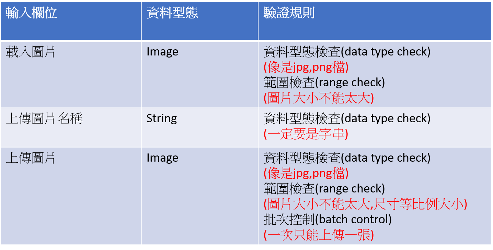
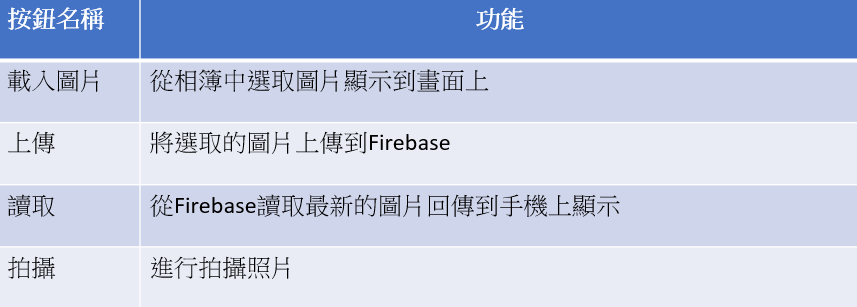
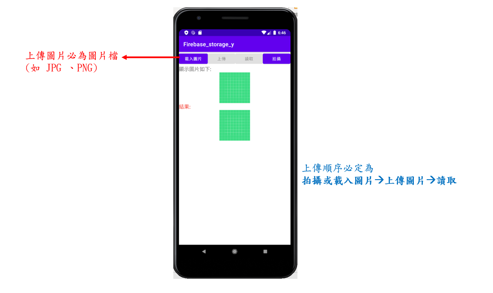
[實際操作說明](https://youtu.be/TQblnyCNGOA)

### 實體關係圖

